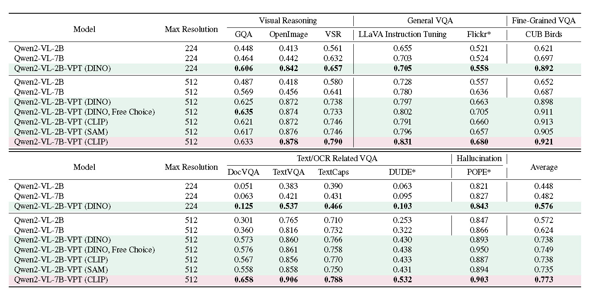
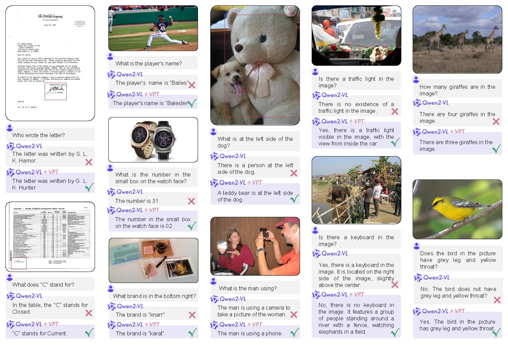

<!-- Improved compatibility of back to top link: See: https://github.com/othneildrew/Best-README-Template/pull/73 -->
<a id="readme-top"></a>
<!--
*** Thanks for checking out the Best-README-Template. If you have a suggestion
*** that would make this better, please fork the repo and create a pull request
*** or simply open an issue with the tag "enhancement".
*** Don't forget to give the project a star!
*** Thanks again! Now go create something AMAZING! :D
-->

# [Introducing Visual Perception Token into Multimodal Large Language Model](https://arxiv.org/abs/) 
<!-- (2025) -->

TL;DR (1) - Allow the MLLM to **control** its own vision perception process.

TL;DR (2) - Treat visual perception as a function calling process and control the perception process through **Visual Perception Tokens**. The MLLM outputs Visual Perception Tokens in the same manner as natural language tokens.

<p align="left">
[<a href="https://arxiv.org/abs/">Paper</a>] 
<!-- [<a href="https://huggingface.co/spaces/rp-yu/">Playground</a>] -->
[<a href="https://huggingface.co/collections/rp-yu/vpt-models-67b6afdc8679a05a2876f07a">Models</a>]
[<a href="https://huggingface.co/datasets/rp-yu/VPT_Datasets">Datasets</a>]
</p>

## Graphical Abstract

🔧 The image illustrates two types of Visual Perception Tokens. 
The Region Selection Token carries explicit semantic information, 
representing important regions with bounding boxes, while the Vision Re-Encoding Token lacks semantic information. 
Instead, the Vision Projector extracts control information directly from its hidden state. 
The inference process incorporating Visual Perception Tokens can be divided into three stages. 
First, the MLLM generates Visual Perception Tokens based on the image and the given question. 
Next, the Vision Branches perform a second perception of the image guided by the Visual Perception Tokens. 
Finally, the MLLM utilizes the Vision Features obtained from both perception stages to answer the question.


👍 Performance comparison of MLLMs with and without Visual Perception Tokens. 
Datasets marked with ``*'' are not used in the training process. 
A 2B model with Visual Perception Tokens can even outperform the 7B model without Visual Perception Tokens.


👍 Examples collected from the testing sets. The responses were generated by the 7B model and the 2B+VPT model.

<!-- TABLE OF CONTENTS -->
## Table of Contents
<!-- <summary style="font-size: 20px;"></summary> -->
<ol>
  <li><a href="#inventory">Inventory</a></li>
  <li><a href="#environment-setup">Environment Setup</a></li>
  <li><a href="#training-and-evaluation">Training and Evaluation</a></li>
</ol>

## Inventory

### Models

| Model 	| Stage 	| Base Model 	| Finetuned Modules 	| #Total Params 	| Download Link 	|
|---	|---	|---	|---	|---	|---	|
| Qwen2-VL-2b-VPT-Det-Alignment 	| After Alignment 	| Qwen/Qwen2-VL-2B-Instruct 	| Projector 	| 2.75B 	|  [🤗 HuggingFace Model](https://huggingface.co/rp-yu/Qwen2-VL-2b-VPT-Det-Alignment)	|
| Qwen2-VL-2b-VPT-Seg-Alignment 	| After Alignment 	| Qwen/Qwen2-VL-2B-Instruct 	| Projector 	| 2.76B 	|  [🤗 HuggingFace Model](https://huggingface.co/rp-yu/Qwen2-VL-2b-VPT-Seg-Alignment)	|
| Qwen2-VL-2b-VPT-CLIP 	| After Instruction Tuning 	| Qwen/Qwen2-VL-2B-Instruct 	| All 	| 2.45B 	|  [🤗 HuggingFace Model](https://huggingface.co/rp-yu/Qwen2-VL-2b-VPT-CLIP)	|
| Qwen2-VL-2b-VPT-Det 	| After Instruction Tuning 	| Qwen2-VL-2b-VPT-Det-Alignment 	| All 	| 2.75B 	|  [🤗 HuggingFace Model](https://huggingface.co/rp-yu/Qwen2-VL-2b-VPT-Det)	|
| Qwen2-VL-2b-VPT-Det-NoPrompt 	| After Instruction Tuning 	| Qwen2-VL-2b-VPT-Det-Alignment 	| All 	| 2.75B 	|  [🤗 HuggingFace Model](https://huggingface.co/rp-yu/Qwen2-VL-2b-VPT-Det-NoPrompt)	|
| Qwen2-VL-2b-VPT-Seg 	| After Instruction Tuning 	| Qwen2-VL-2b-VPT-Seg-Alignment 	| All 	| 2.76B 	|  [🤗 HuggingFace Model](https://huggingface.co/rp-yu/Qwen2-VL-2b-VPT-Seg)	|
| Qwen2-VL-7b-VPT-CLIP 	| After Instruction Tuning 	| Qwen/Qwen2-VL-7B-Instruct 	| LoRA-r512 	| 8.32B 	|  [🤗 HuggingFace Model](https://huggingface.co/rp-yu/Qwen2-VL-7b-VPT-CLIP)	|

- Our model can be categorized into two types based on the training stage. In cases where an additional vision encoder is required, an extra alignment step is performed. The aligned model then serves as the starting point for the subsequent instruction tuning process.  
- The 7B model is fine-tuned using LoRA. The released model has already been merged.  
- The NoPrompt model corresponds to the Free Choice model. It does not rely on specific prompts to trigger the Visual Perception Token; instead, the model autonomously decides whether to use the Visual Perception Token and which type to apply.

### Datasets
Our training and evaluation data are hosted on [🤗 VPT Datasets](https://huggingface.co/datasets/rp-yu/VPT_Datasets). 
The entire dataset is divided into multiple splits, with each split corresponding to a separate JSON file. 
For the evaluation datasets, we have annotated the reasoning process involving the use of the Visual Perception Token. 
During evaluation, adjustments need to be made based on different models.

| Dataset 	| Stage 	| Compatible Model 	| Traning/Evaluation 	| #Samples 	|
|---	|---	|---	|---	|---	|
| MixVRT_CLIP_Full 	| Instruction Tuning 	| CLIP 	| Training 	|  829k  	|
| MixVRT_Detection_Full 	| Instruction Tuning 	| Det 	| Training 	|  829k  	|
| MixVRT_Seg_Full 	| Instruction Tuning 	| Seg 	| Training 	|  829k  	|
| CUB_Birds_action_test 	| Instruction Tuning 	| All 	| Evaluation 	|  0.5k  	|
| DocVQA_region_test 	| Instruction Tuning 	| All 	| Evaluation 	|  0.9k  	|
| DUDE_region_test 	| Instruction Tuning 	| All 	| Evaluation 	|  0.6k  	|
| Flickr30k_action_test 	| Instruction Tuning 	| All 	| Evaluation 	|  1.5k  	|
| LLaVA_COCO_free_action_test 	| Instruction Tuning 	| All 	| Evaluation 	|  1k  	|
| LLaVA_COCO_single_action_test 	| Instruction Tuning 	| All 	| Evaluation 	|  1k  	|
| OI_region_test 	| Instruction Tuning 	| All 	| Evaluation 	|  1k  	|
| POPE_action_test 	| Instruction Tuning 	| All 	| Evaluation 	|  3k  	|
| TextCap_region_test 	| Instruction Tuning 	| All 	| Evaluation 	|  8.5k  	|
| TextVQA_region_test 	| Instruction Tuning 	| All 	| Evaluation 	|  0.5k  	|
| VSR_region_test 	| Instruction Tuning 	| All 	| Evaluation 	|  0.4k  	|
| llava_alignment_detection_qwen_response_train 	| Alignment 	| Det 	| Training 	|  585k  	|
| llava_alignment_seg_qwen_response_train 	| Alignment 	| Seg 	| Training 	|  585k  	|
| llava_alignment_detection_qwen_response_eval 	| Alignment 	| Det 	| Evaluation 	|  5k  	|
| llava_alignment_seg_qwen_response_eval 	| Alignment 	| Seg 	| Evaluation 	|  5k  	|

### Code Development Note
Our code is primarily based on Transformers and Llama-Factory. 
[DevNote](DevNote.md) outlines the core modifications we made to the original *transformers* and *Llama-Factory* libraries. It serves as an overview to help readers understand our code structure and provides a starting point for exploration.


<p align="right"><a href="#readme-top"></a></p>

## Environment Setup
### Prepare Enviroment
Our environment is largely consistent with the dependencies of Transformers 4.45.2 and LLaMA-Factory 0.9.1.dev0. The following are the steps to set up our environment.
```bash
# clone transformers 4.45.2
git clone https://github.com/huggingface/transformers.git
cd transformers
git checkout v4.45.2
# copy modeling_qwen2_vl_vpt.py
mkdir -p "src/transformers/models/qwen2_vl_vpt"
cp "VPT/transformers/src/transformers/models/qwen2_vl_vpt/modeling_qwen2_vl_vpt.py" "src/transformers/models/qwen2_vl_vpt/"
# modify the path of transformers and llama-factory in env.yml file
# create environment
cd /to/this/folder
conda env create -f environment.yml
```

### Prepare Dataset
Prepare the following datasets and adjust the image path in the json files downloaded from [🤗 VPT Datasets](https://huggingface.co/datasets/rp-yu/VPT_Datasets).
- COCO2017
- CUB_200_2011
- DocVQA
- DUDE
- Flickr30k
- GQA
- OCRVQA
- OpenImage
- TextVQA
- VG
- VSR

<p align="right"><a href="#readme-top"></a></p>

## Training and Evaluation
Our training and evaluation are supported by LLaMA-Factory. Adjust the path in the `configs/*.yaml` files before run the code.
```bash
cd LLaMA-Factory
# Detection Projector Alignment
llamafactory-cli train configs/Qwen2-VL-2b-VPT-Det-Alignment.yaml
# Segmentation Projector Alignment
llamafactory-cli train configs/Qwen2-VL-2b-VPT-Seg-Alignment.yaml
# 2b Model + VPT-original vision encoder
llamafactory-cli train configs/Qwen2-VL-2b-VPT-CLIP.yaml
# 2b Model + VPT-DINO
llamafactory-cli train configs/Qwen2-VL-2b-VPT-Det.yaml
# 2b Model + VPT-SAM
llamafactory-cli train configs/Qwen2-VL-2b-VPT-Seg.yaml
# 7b Model + VPT-original vision encoder
llamafactory-cli train configs/Qwen2-VL-7b-VPT-CLIP.yaml
```

The folder `evaluation` contains the code for evaluation. Run `python evaluation.py` to finish the evaluation process.

<p align="right"><a href="#readme-top"></a></p>

<!-- ## Citation
If you find our work useful, please cite using this BibTeX:
```bibtex
@misc{yu2024api,
      title={Introducing Visual Perception Token into Multimodal Large Language Model}, 
      author={Runpeng Yu and Xinyin Ma and Xinchao Wang},
      year={2025},
      booktitle={},
}
```
<p align="right"><a href="#readme-top"></a></p> -->
